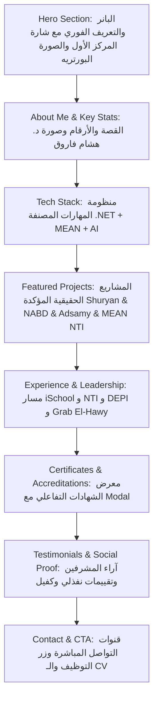

# 🚀 خطة التطبيق البرمجي في الـ Portfolio (Portfolio Integration & UI/UX Plan) - محدثة ومصححة

---

## 1. التوزيع الهندسي للأقسام في الصفحة الرئيسية (Page Architecture)

---

## 2. تفاصيل المشاريع الحقيقية المعتمدة في قسم Projects

1. **مشروع Shuryan (شريان) - الفائز بالمركز الأول على مستوى الجمهورية (DEPI):**
   - *الدور:* Backend Engineer (C#, ASP.NET Core Web API, Clean Architecture, EF Core, SQL Server).
   - *الوسائط:* شارة 1st Place، وربط بصورة تكريم DEPI مع د. هشام فاروق.

2. **مشروع NABD (نبض) - مشروع التخرج الطبي الذكي (تقدير A+):**
   - *الدور:* Team Leader & Backend Architect (قيادة 6 مهندسين، بناء منظومة السجل الطبي الموحد ودمج نماذج الـ AI).

3. **مشروع Adsamy Portal:**
   - *الدور:* Full Stack / Frontend Developer (بوابة تفاعلية سريعة لشركة دعاية وإعلان).

4. **مشروع MEAN Stack Accelerator (NTI):**
   - *الدور:* MEAN Stack Developer (Angular, Node.js, Express, MongoDB).

---

## 3. تكامل الصور الحقيقية في الموقع واستبدال Placeholders

- **Hero & About:** استخدام `src/assets/images/profile/seif-portrait-avatar.jpg`.
- **Award Highlight:** استخدام `src/assets/images/profile/seif-with-dr-hesham-farouk-depi.png` كدليل حفل ختام DEPI.
- **Defense Story:** استخدام `src/assets/images/profile/seif-defense-formal.jpg` في مناقشة مشروع نبض.
- **معرض الشهادات:** ربط كافة صور الشهادات الـ 10 الحقيقية مع ميزة التكبير (Lightbox Modal).
- **معرض التقييمات:** عرض لقطات الشاشة الأصلية لريفيو نفذلي (أحمد حسن) وريفيو كفيل (عمر ياسر) وتوصيات NTI.
