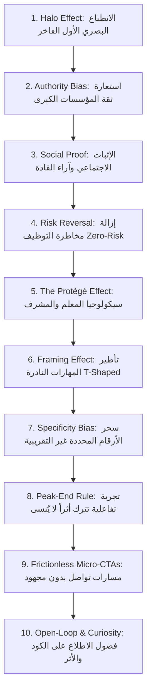

# 🧠 التحليل السيكولوجي والتسويقي المتقدم: سيكولوجيا الإقناع وهندسة الثقة في الـ Portfolio
## (Web Psychology, Neuromarketing & Conversion Architecture for Tech Recruiters & Freelance Clients)

---

## 🎯 المقدمة: كيف يفكر زائر موقعك في أول 5 ثوانٍ؟

عندما يدخل **مسؤول توظيف (Tech Recruiter / Engineering Manager)** أو **عميل فريلانس دولي / محلي (High-Ticket Client)** إلى موقعك، فإن دماغه يتخذ قراراً لا واعياً وسريعاً خلال **أول 3 إلى 5 ثوانٍ** عبر ما يُعرف في علم النفس الإدراكي بـ **(System 1 - التفكير التلقائي السريع)** قبل أن يبدأ عقله التحليلي **(System 2)** في قراءة سطر كود واحد!

الهدف من هذا الملف هو تحويل موقعك من مجرد "صفحة تعرض معلومات" إلى **آلة إقناع سيكولوجية (Psychological Trust Engine)** تزرع الثقة الفورية وتزيل أي تردد أو مخاطرة (Risk Reduction) لدى من يراك.

---

## 🏛️ 1. المبادئ السيكولوجية الـ 10 لتحقيق الثقة المطلقة (The 10 Psychological Levers)

---

### 👑 1. تأثير الهالة (The Halo Effect) & الجمالية المفرطة
- **المفهوم النفسي:** يميل العقل البشري تلقائياً لافتراض أن الشيء الذي يبدو **أنيقاً وفخماً ومنظماً للغاية** من الخارج، يحتوي بالضرورة على **كود قوي واحترافية استثنائية** في الداخل.
- **التطبيق العملي على موقعك:**
  - استخدام لوحة ألوان داكنة فاخرة (Deep Slate / Dark Emerald / Cyber Gold) مستوحاة من منصات الـ Enterprise (مثل Linear و Vercel و Stripe).
  - استخدام صورتك الشخصية الرسمية المبتسمة بالبدلة (`seif-portrait-avatar.jpg`) محاطة بتوهج خفيف (Ambient Glow) يعكس الهيبة والراحة النفسية في آن واحد.

---

### 🏛️ 2. انحياز السلطة واستعارة المصداقية (Authority Bias & Borrowed Trust)
- **المفهوم النفسي:** عندما يشاهد الدماغ أسماء وشعارات مؤسسات مرموقة ذات سلطة معرفية أو حكومية، فإنه ينقل احترامه وثقته بهذه المؤسسات إلى صاحب البروفايل مباشرة (Trust Transfer).
- **التطبيق العملي على موقعك:**
  - **شريط شعارات الجهات المعتمدة (Trust Bar) مباشرة تحت الـ Hero:**
    - `Microsoft` | `Ministry of Communications (MCIT)` | `NTI` | `DEPI` | `ITI` | `HackerRank` | `Zagazig University`
  - إبراز صورة التكريم مع **د. هشام فاروق (مستشار وزير الاتصالات)** بجانب شهادة المركز الأول على مستوى الجمهورية.

---

### 🛡️ 3. الإثبات الاجتماعي المتقاطع (Cross-Platform Social Proof)
- **المفهوم النفسي:** العميل أو الشركة لا تصدق ما تقوله أنت عن نفسك، بل تصدق ما يقوله **الآخرون** عنك، خاصة إذا كان الموصون من مستويات مختلفة (مدراء، زملاء، وعملاء).
- **التطبيق العملي على موقعك:**
  - **التثليث السيكولوجي للشهادات (Triangulation of Proof):**
    1. *رأي الإدارة والتوجيه:* توصية **أ. شريف عادل** (مسئول مقر NTI) تشهد بالتزامك وجديتك وأخلاقك.
    2. *رأي الخبير التقني:* توصية **م. ريان محمد** (Senior Frontend Mentor) تشهد بعمقك التقني وفضولك البرمجي.
    3. *رأي العميل التجاري:* تقييم **أحمد حسن وعمر ياسر** (5/5 نجوم بنسبة إتمام 100%) يشهد بالتسليم في الموعد والجودة العالية.
  - إضافة شارة **8,388+ متابع على LinkedIn** كدليل على الشعبية والتأثير داخل مجتمع المطورين.

---

### ⚖️ 4. إلغاء المخاطرة التوظيفية (Risk Reversal & Loss Aversion)
- **المفهوم النفسي:** أكبر خوف لدى مدير التوظيف أو العميل ليس "كم ستتقاضى؟" بل **"هل سأندم على اختياره ويضيع وقتي ومالي؟"** (الخوف من الخسارة Loss Aversion).
- **التطبيق العملي على موقعك:**
  - وضع شارات طمأنة واضحة (Zero-Risk Badges):
    - `✅ 100% On-Time Delivery Guarantee`
    - `✅ Clean Architecture & Fully Documented Code`
    - `✅ Verified 5.0/5.0 Client Rating`
    - `✅ Agile / Continuous Communication`

---

### 👨‍🏫 5. تأثير المعلم والتمكن الإدراكي (The Protégé / Master Instructor Effect)
- **المفهوم النفسي:** القاعدة الذهبية تقول: *"من يستطيع تعليم البرمجة المعقدة للأطفال والشباب، فهو يمتلك فهماً جذرياً للكود ومهارات تواصل تفوق 99% من المبرمجين الآخرين."*
- **التطبيق العملي على موقعك:**
  - تخصيص كارت مميز بعنوان: **"The Mentor's Advantage"**:
    - "تدريب مئات الطلاب في iSchool ومبادرة DEMI أثبت قدرتي على تبسيط المشاكل المعقدة، قيادة الفرق، والتواصل الفعال مع كافة أطراف المشروع (من الإدارة وحتى العميل النهائي)."

---

### 💎 6. تأطير المهارة النادرة (The T-Shaped & Dual-Power Framing)
- **المفهوم النفسي:** تجنب الظهور كـ "مطور عادي"، بل تأطير مهاراتك كمزيج نادر لا يتكرر كثيراً في السوق.
- **التطبيق العملي على موقعك:**
  - **الإطار التسويقي لسيف:**
    - *"مهندس باك إند صلب (.NET Enterprise & Clean Architecture) يمتلك حسّاً تسويقياً وبصرياً فريداً (Presentation & UI Master) تم تتويجه بالمركز الأول على مستوى الجمهورية."*
  - هذا الدمج يلغي فكرة أنك "مجرد مبرمج معزول عن البيزنس"، بل يظهرك كشريك تقني يفهم أهداف العمل وربحية المنتج.

---

### 🔢 7. انحياز التحديد والدقة الرقمية (The Specificity Bias)
- **المفهوم النفسي:** الأرقام المحددة والدقيقة تولد تصديقاً نفسياً أعلى بكثير من الأرقام العامة التقريبية (مثال: `GPA 3.11/4.00` و `210+ Hours NTI Training` و `8,388 Followers` أكثر إقناعاً من كتابة "معدل جيد" أو "متابعون كثر").
- **التطبيق العملي على موقعك:**
  - عرض الإحصائيات بأرقام حقيقية دقيقة:
    - 🥇 **#1 Top Rank** في مبادرة DEPI من بين آلاف المتدربين.
    - 🎓 **210+ Hours** تدريب عملي شاق بمعهد NTI.
    - 👥 **8,388+** مهتم ومتابع لشبكة لينكد إن.
    - ⭐ **5.0 / 5.0** تقييم مثالي في العمل الحر.

---

### 🎡 8. قاعدة الذروة والنهاية (The Peak-End Rule & Micro-Interactions)
- **المفهوم النفسي:** يتذكر الإنسان من أي تجربة أمرين فقط: **أعلى نقطة إبهار (Peak)** و**اللحظة الأخيرة قبل المغادرة (End)**.
- **التطبيق العملي على موقعك:**
  - **الذروة (The Peak):**
    - معرض شهادات تفاعلي (Interactive Lightbox) عند الضغط على أي شهادة تنفتح بطريقة سينمائية سلسة (Smooth Scale & Blur Backdrop) مع إمكانية فحص تفاصيلها وكود التحقق.
    - كروت المشاريع مع تأثير 3D Tilt خفيف عند تحريك الماوس.
  - **النهاية (The End):**
    - قسم تواصل فاخر (Get in Touch) يحتوي على بطاقة جاهزة للنسخ بنقرة واحدة لبيانات التواصل وزر حجز محادثة فورية أو مراسلة واتساب.

---

### ⚡ 9. الدعوة السلسة للإجراء (Frictionless CTAs & Fitts's Law)
- **المفهوم النفسي:** كل نقرة أو مجهود إضافي تطلبه من العميل يقلل نسبة التحويل (Conversion Rate) بمقدار 20%.
- **التطبيق العملي على موقعك:**
  - زر `WhatsApp Direct Chat` يفتح المحادثة برسالة مسبقة التجهيز: *"مرحباً سيف، اطلعت على البورتفوليو الخاص بك وأود مناقشة فرصة عمل / مشروع معاك."*
  - زر `Download CV` بنقرة واحدة مباشرة دون تحويل لصفحات وسيطة.
  - زر `Copy Email` مع إشعار نجاح فوري (Toast notification: "تم نسخ البريد بنجاح!").

---

### 🔍 10. إثبات الكود والتنفيذ الواقعي (Open-Loop & Proof of Work)
- **المفهوم النفسي:** الشركات التقنية الكبرى تبحث عن دليل هندسي: كيف يفكر؟ كيف يكتب المعمارية؟
- **التطبيق العملي على موقعك:**
  - في بطاقة مشروع "شريان" و"نبض"، لا تكتفِ بوضع وصف عام، بل أضف تبويب **"Engineering Architecture"**:
    - عرض مخطط هيكلي مصغر (Architecture Flow) يوضح:
      - `API Gateway -> JWT Auth -> CQRS Handlers -> EF Core -> SQL Server / AI Diagnostic Pipeline`
  - هذا يثبت أنك مهندس برمجيات حقيقي يتقن معمارية النظم (Systems Design).

---

## 📋 جدول تطبيق الحيل النفسية على عناصر الموقع (Implementation Matrix)

| عنصر الموقع (Component) | الحيلة / المبدأ السيكولوجي | العنصر الواقعي من ملفاتك المستخدم كإثبات | الأثر النفسي المتوقع على الزائر |
|---|---|---|---|
| **Top Navbar & Badge** | Social Identity & Availability | شارة `🟢 Available for Hire (Remote/Hybrid)` | إحساس بفرصة متاحة وحصرية جاهزة للاستثمار. |
| **Hero Headline** | High-Status Positioning | `🏆 1st Place Winner Nationwide (DEPI)` | التميز الفوري عن 99% من الخريجين والمنافسين. |
| **Hero Image** | Warmth & Competence Matrix | صورتك الرسمية المبتسمة `seif-portrait-avatar.jpg` | بناء ألفة وثقة بصرية لا واعية خلال 3 ثوانٍ. |
| **Trust Logos Bar** | Authority Transfer | شعارات `Microsoft, MCIT, NTI, ITI, HackerRank` | استعارة ثقة وهيمنة كبرى الشركات والمؤسسات. |
| **Stats Counter** | Specificity Bias | `Top 1`, `8.3K+ Network`, `5.0 Stars`, `210+ Hrs` | صدمة رقمية تثبت الإنجاز والنشاط الاستثنائي. |
| **Project Shuryan** | Social Prestige & Nation-level Impact | صورة التكريم مع د. هشام فاروق وشهادة DEPI | التأكيد على أن الكود والمشروع خضع لتحكيم قومي رفيع. |
| **Project NABD** | Leadership & AI Innovation | مشروع التخرج A+ وقيادة 6 مهندسين | إثبات القدرة على قيادة الفرق وحل المشاكل الطبية المعقدة. |
| **Certificates Grid** | Verified Proof & Transparency | صور الشهادات الأصلية + أكواد التحقق الرسمية | القضاء على أي شك في صحة الشهادات والمهارات. |
| **Testimonials** | Triangulated Social Proof | آراء أ. شريف عادل وم. ريان وتقييم نفذلي وكفيل | طمأنة العميل من جانب الإدارة، التقنية، وسرعة التسليم. |
| **Contact Section** | Frictionless Action (Zero Resistance) | زر الواتساب المباشر وزر نسخ الإيميل بضغطة واحدة | زيادة معدل التحويل والمراسلة الفورية. |
