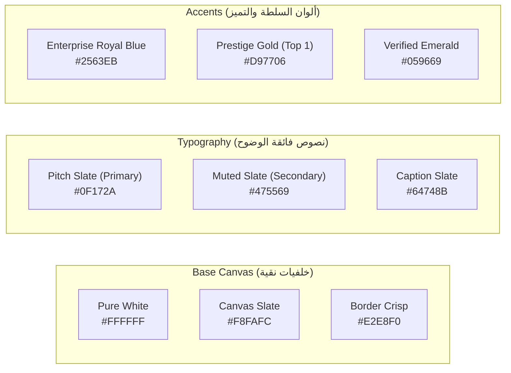

# 🎨 دليل الهوية البصرية ونظام التصميم الاحترافي (Brand Identity & Enterprise Design System)
## (Clean, High-Trust, Corporate Tech Style — No AI Clichés, No Dark-Neon Gimmicks)

---

## 🎯 1. فلسفة التصميم (Design Philosophy: Enterprise High-Trust Minimalism)

الهدف هو بناء هوية بصرية مستوحاة من **كبرى الشركات التقنية العالمية (Tier-1 Tech & Engineering Brands)** مثل **Stripe, Apple, Linear, Vercel, Figma, Notion**:

- ❌ **الابتعاد التام عن استايل الـ AI المستهلك:** لا خلفيات سوداء كئيبة، لا نيون بنفسجي صارخ، ولا توهجات عشوائية تعطي انطباعاً بالمشاريع الهواة.
- ✅ **الاعتماد على النقاء والفخامة الهندسية (Clean Corporate Aesthetic):**
  - خلفيات بيضاء وعاجية نقية ومريحة للعين (Clean White & Slate Canvas).
  - تباين قراءة مثالي (Ultra-Crisp Typography) يجعل قراءة المشاريع والشهادات ممتعة ومريحة لمسؤولي التوظيف والعملاء.
  - لمسات ألوان محسوبة بدقة تعبر عن الثقة والاحترافية والجوائز الرسمية.

---

## 🎨 2. لوحة الألوان المعتمدة (The Enterprise Color Palette)



### 📋 تفاصيل الأكواد اللونية ووظيفة كل لون:

| التصنيف | اسم اللون | كود HEX | كود Tailwind / CSS | الاستخدام في الموقع |
|---|---|---|---|---|
| **الخلفية الأساسية** | Pure White | `#FFFFFF` | `bg-white` | خلفية البطاقات الرئيسية، مساحات القراءة، والـ Modals. |
| **خلفية الأقسام** | Soft Slate Surface | `#F8FAFC` | `bg-slate-50` | خلفية الصفحة العامة للفصل البصري المريح بين الأقسام. |
| **خلفية التباين الخفيف** | Subtle Tint Canvas | `#F1F5F9` | `bg-slate-100` | خلفية أشرطة المهارات، حقول الإدخال، وخلفية الـ Code Blocks. |
| **الحدود والفواصل** | Crisp Divider Border | `#E2E8F0` | `border-slate-200` | خطوط الفواصل الدقيقة (1px) لإعطاء هيكلية هندسية منظمة. |
| **النص الأساسي** | Pitch Navy Slate | `#0F172A` | `text-slate-900` | العناوين الرئيسية، أسماء المشاريع، والأرقام القياسية (أعلى درجات الوضوح). |
| **النص الثانوي** | Neutral Slate Text | `#475569` | `text-slate-600` | نصوص الفقرات، وصف المشاريع، وتفاصيل الخبرات. |
| **النصوص التوضيحية** | Muted Caption | `#64748B` | `text-slate-500` | التواريخ، وسوم التقنيات، وأكواد الشهادات. |
| **اللون المميز الأساسي** | Enterprise Royal Blue | `#2563EB` | `text-blue-600` / `bg-blue-600` | الأزرار الأساسية (CTAs)، الروابط، وأيقونات الباك إند (لون الثقة المؤسسية). |
| **لون الجوائز والشرف** | Prestige Warm Amber | `#D97706` | `text-amber-600` / `bg-amber-50` | شارة المركز الأول DEPI، وشارات الجوائز، والنجوم 5/5. |
| **لون التأكيد والتحقق** | Verified Emerald Green | `#059669` | `text-emerald-600` / `bg-emerald-50` | شارة `Open to Work`، علامات النجاح 100%، وأختام التحقق للشهادات. |

---

## 🔤 3. منظومة الخطوط والطباعة (Typography Hierarchy)

- **الخط الإنجليزي الأساسي:** **`Plus Jakarta Sans`** أو **`Inter`** (خط هندسي حديث معتمد في منتجات Google و Stripe).
- **الخط العربي الأساسي:** **`IBM Plex Sans Arabic`** أو **`Cairo`** (خط رسمي أنيق وصارم، يبتعد عن الخطوط الزخرفية ويعطي إحساساً بالمؤسسات الدولية).

### مقاييس العناوين والنصوص:
- **Hero Title:** `text-4xl md:text-6xl font-extrabold text-slate-900 tracking-tight`
- **Section Heading:** `text-2xl md:text-3xl font-bold text-slate-900`
- **Card Subheading:** `text-lg md:text-xl font-semibold text-slate-800`
- **Body Paragraph:** `text-base text-slate-600 leading-relaxed font-normal`
- **Badges & Tags:** `text-xs md:text-sm font-medium tracking-wide uppercase`

---

## 🧱 4. نمط المكونات والبطاقات (UI Components & Cards Style)

### أ. البطاقات (Clean Enterprise Cards):
- **الخلفية:** أبيض ناصع `#FFFFFF`.
- **الحدود:** إطار رقيق ونظيف جداً `border: 1px solid #E2E8F0`.
- **الظلال (Shadows):** ظلال ناعمة ومتعددة الطبقات بدون أي سواد حاد:
  ```css
  box-shadow: 0 1px 3px 0 rgba(15, 23, 42, 0.05), 0 1px 2px -1px rgba(15, 23, 42, 0.05);
  transition: all 0.25s cubic-bezier(0.16, 1, 0.3, 1);
  ```
- **تأثير التحويم (Hover Effect):** ارتفاع سلس جداً (Lift up by 3px) مع زيادة نعومة الظل:
  ```css
  hover:translate-y-[-3px] hover:shadow-lg hover:border-blue-200
  ```

### ب. الشارات والأوسمة (Pill Badges):
- **شارة المركز الأول DEPI:**
  - خلفية: عاجي ذهبي فاتح `#FEF3C7` (Amber 100).
  - النص: ذهبي دافئ غامق `#92400E` (Amber 800) مع أيقونة 🏆.
  - الإطار: `#FDE68A` (Amber 200).
- **شارة متاح للعمل (Open to Work):**
  - خلفية: أخضر زمردي فاتح `#ECFDF5` (Emerald 50).
  - النص: أخضر زمردي عميق `#065F46` (Emerald 800) مع نقطة نابضة خضراء `animate-pulse`.
- **شارات التقنيات (Tech Tags):**
  - خلفية: رمادي ناعم `#F1F5F9` (Slate 100).
  - النص: كحلي أردوازي `#334155` (Slate 700).
  - الإطار: `#E2E8F0`.

### ج. الأزرار (Action Buttons - CTAs):
1. **الزر الأساسي (Primary CTA - e.g., Download CV / Contact):**
   - خلفية: أزرق ملكي `#2563EB` (Blue 600) مع تأثير hover `#1D4ED8`.
   - النص: أبيض ناصع مع خط عريض وثابت.
   - الزوايا: نصف دائرية ناعمة (`rounded-xl` أو `rounded-full`).
2. **الزر الثانوي (Secondary CTA - e.g., View Projects):**
   - خلفية: أبيض ناصع `#FFFFFF` مع إطار `1px solid #CBD5E1`.
   - النص: `#0F172A` مع hover `#F8FAFC`.

---

## 📸 5. توجيهات عرض الصور والوسائط (Media Presentation Guidelines)

1. **صورة البروفايل الرسمية (`seif-portrait-avatar.jpg`):**
   - تُعرض داخل إطار دائري أو مستطيل بزوايا ناعمة (`rounded-2xl`).
   - إطار أبيض عريض مع ظل خفيف (Clean Drop Shadow)، مما يبرز البدلة والابتسامة الطبيعية بشكل فخم.
2. **صورة التكريم مع د. هشام فاروق (`seif-with-dr-hesham-farouk-depi.png`):**
   - تُعرض كبطاقة شرفية متميزة بجانب مشروع شريان مع تعليق أنيق بالأسفل: *"حفل ختام مبادرة رواد مصر الرقمية وتكريم مشروع شريان بالمركز الأول جمهورية"*.
3. **معرض الشهادات (Certificates Grid):**
   - بطاقات بيضاء نقية تحتوي على صورة مصغرة واضحة للشهادة مع عنوان الجهة المانحة (Microsoft / DEPI / ITI / HackerRank) وزر `🔍 معاينة الشهادة بالكامل` يفتح نافذة Lightbox بيضاء وأنيقة.

---

## 💎 الخلاصة: الانطباع الذهني الذي ستتركه هذه الهوية (Brand Perception)
عندما يفتح موقعك أي مدير توظيف في شركة مثل **Vodafone, Microsoft, Fawry, CIB, أو شركات الخليج وأوروبا**:
- سيشعر فوراً أنه أمام **مهندس محترف، منظم، وناضج (Mature Corporate Engineer)**.
- لن يشعر بأي تشويش بصري؛ كل شيء مقروء، الأرقام واضحة، الأدلة معروضة بأناقة، والوصول لملف الـ CV والتواصل يتم في ثوانٍ معدودة.
